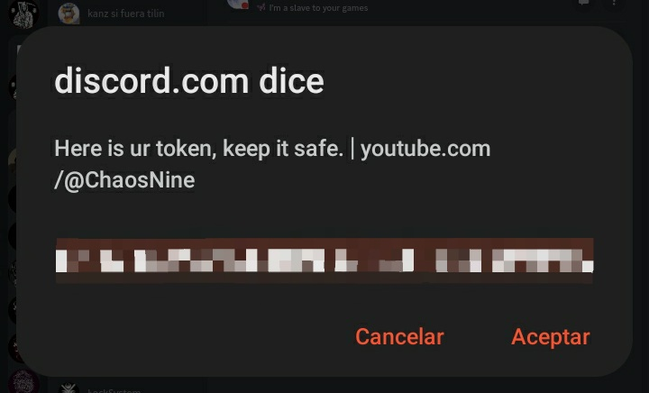

    
    
<i>A powerful  API created to see your Discord Token on your phone</i>

    <h5><a href="https://discord.gg/QqSds9fVwR">Discord</a></h5>

    
    
    

<h3>Screenshot</h3>

<h3>Use</h3>

To use the API, you have this video <a href="https://youtube.com/shorts/z6_YHU232rc?feature=share">here</a>
